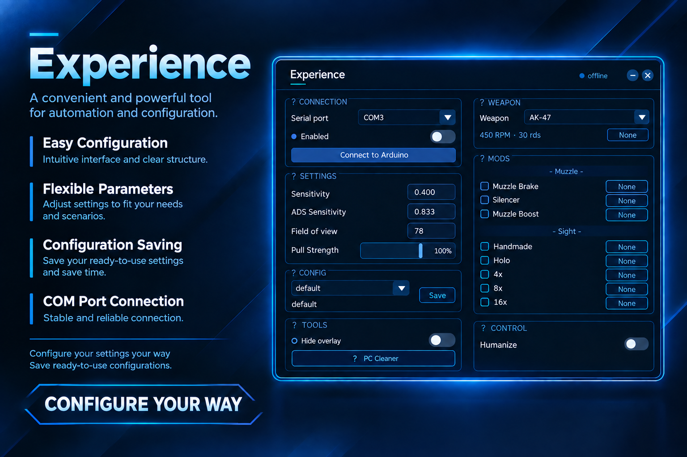

# Experience

Experience is a software interface for managing and configuring automated scenarios, with support for connecting an external device via Arduino / COM port.

## Features

- Connect and control Arduino devices via COM port
- Adjust Sensitivity and ADS Sensitivity
- Configure Field of View and Pull Strength
- Create and save configurations
- Separate parameters for different profiles
- Configure weapons, modifications, and sights
- Additional control parameters
- Humanize mode
- Compact graphical interface
- Quickly switch between saved configurations

## Interface

The application provides a unified control window where the main parameters are organized into categories:

- Connection
- Settings
- Configurations
- Tools
- Weapon
- Mods
- Control

All parameters are accessible from a single window without the need to navigate through multiple interfaces.

## Configurations

Settings can be saved as separate profiles and loaded whenever needed. This allows different parameter sets to be used without having to manually configure everything again.

## Connection

The application uses a serial COM interface to communicate with an external device. The available COM port can be selected directly within the application.

## Firmware and Examples

The project may also include example data and firmware files for various devices.

A `.txt` file for **Logitech G102** is provided as a reference. It contains example device data (bytes) that can be used for analysis and adaptation to a specific device. If necessary, the values can be modified according to the data and byte structure of the mouse being used.

The package may also include some ready-to-use `.hex` firmware files for other compatible mice. These firmware files are intended to be flashed using **AVRDUDE**.

Official AVRDUDE releases are available here:

https://github.com/avrdudes/avrdude/releases

Before using a `.hex` file, make sure that the firmware is compatible with the specific device model and the microcontroller being used.

## Project Status

The project is actively being developed. Features and interface elements may change in future versions.

---

**Experience — a unified interface for configuration, control, and management.**
